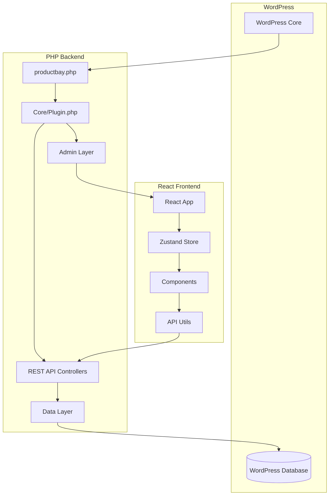

# ProductBay Architecture Documentation

This document provides a comprehensive overview of the ProductBay WordPress plugin architecture, detailing how different components interact and the design patterns used throughout the system.

## Table of Contents

- [Overview](#overview)
- [High-Level Architecture](#high-level-architecture)
- [Frontend Architecture](#frontend-architecture)
- [Backend Architecture](#backend-architecture)
- [Data Flow](#data-flow)
- [Component Documentation](#component-documentation)

---

## Overview

ProductBay is a modern WordPress plugin built with a clear separation between backend (PHP) and frontend (React/TypeScript). The architecture follows these core principles:

1. **Separation of Concerns**: PHP handles WordPress integration and data persistence, React handles UI/UX
2. **Single Source of Truth**: Zustand store manages all client-side state
3. **RESTful API**: Communication between frontend and backend via WordPress REST API
4. **Type Safety**: TypeScript ensures type safety across the frontend
5. **Progressive Enhancement**: Server-side rendering with client-side interactivity

---

## High-Level Architecture



---

## Frontend Architecture

The React frontend follows a component-based architecture with centralized state management:

### State Management Strategy

- **Global State**: Zustand stores (`src/store/`)
- **Local State**: React `useState` for UI-only state (modals, dropdowns, etc.)
- **Server State**: Cached in Zustand with TTL and refresh strategies

### Caching Strategy

ProductBay implements a multi-layer caching system for optimal performance:

1. **LocalStorage Cache** (30-minute TTL) - Persists across sessions
2. **Zustand Store Cache** (Session-based) - In-memory instant access
3. **Background Refresh** (5-minute staleness threshold) - Non-blocking updates

---

## Backend Architecture

### PHP Namespace Structure

```
ProductBay\
├── Admin\          # Admin interface registration and asset enqueuing
├── Api\            # REST API endpoints for React frontend
├── Core\           # Plugin initialization and DI container
├── Data\           # Repositories and data access layer
├── Frontend\       # Public-facing shortcodes and handlers
├── Http\           # Request/Response utilities
└── Utils\          # Helper functions and sanitization
```

### API Endpoints

All REST API endpoints are registered under the `/productbay/v1` namespace:

- `/categories` - Fetch WooCommerce product categories
- `/tables` - CRUD operations for product tables
- `/products` - Search and fetch WooCommerce products

---

## Data Flow

### Typical User Interaction Flow

1. **User Action** → React Component
2. **Component** → Zustand Store Action
3. **Store Action** → API Utility Function
4. **API Utility** → WordPress REST API
5. **REST API** → PHP Controller
6. **Controller** → Data Repository
7. **Repository** → WordPress Database
8. **Response** ← Reverse through the chain
9. **Zustand Store** updates state
10. **React Components** re-render with new data

---

## Component Documentation

Detailed documentation for specific components and features:

### UI Components

- **[CategorySelector](./CategorySelectorArchitecture.md)** - Multi-select category picker with intelligent caching

### Pages

- *Coming soon*

### Stores

- *Coming soon*

---

## Design Patterns

### 1. Repository Pattern (Backend)

All database interactions go through repository classes:

```php
// app/Data/TableRepository.php
class TableRepository {
    public function find(int $id): ?Table;
    public function save(Table $table): bool;
}
```

### 2. Hook-Based Store Pattern (Frontend)

Zustand stores are accessed via React hooks:

```typescript
const { categories, preloadCategories } = useTableStore();
```

### 3. Smart Loading Pattern

Components display cached data immediately while fetching fresh data in the background:

```typescript
// Display cache instantly
setCategories(cachedData);

// Fetch fresh data in background
const fresh = await fetchCategories();
setCategories(fresh); // UI updates seamlessly
```

---

## Performance Optimizations

1. **Preloading**: Parent components preload data before child components mount
2. **Memoization**: `useMemo` for expensive computations (filtering, sorting)
3. **Code Splitting**: Lazy loading for page components
4. **Asset Optimization**: Webpack bundles optimized for production

---

## Security Considerations

1. **Nonce Verification**: All API requests include WordPress nonces
2. **Capability Checks**: User permissions verified on backend
3. **Input Sanitization**: All user inputs sanitized via WordPress functions
4. **Output Escaping**: All output properly escaped for XSS prevention


---

## Build Process & Release
We cannot use this development project directly in production. To get a distribution-ready zip file of the plugin we can run `bun run release`, which will give us an installable zip for our plugin with the latest changes.

Learn more - **[Release Process & Build Architecture](./RELEASE.md)**.

---

**Last Updated**: 2026-01-20  
**Maintainer**: ProductBay Development Team
