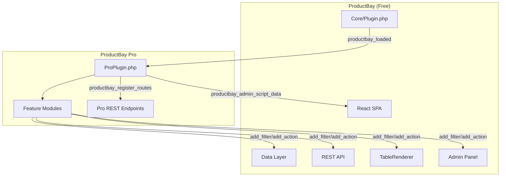
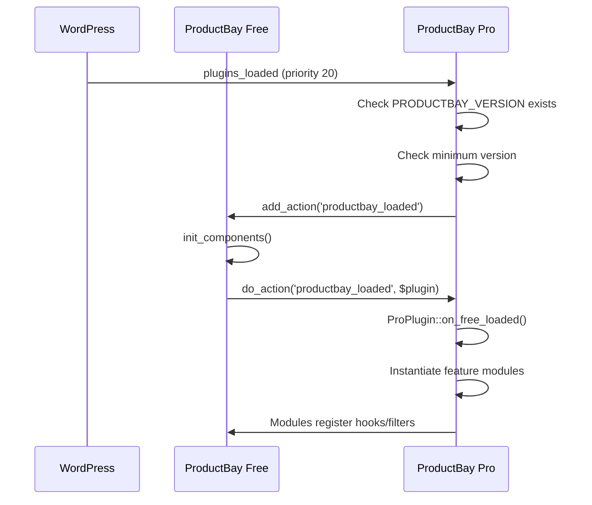
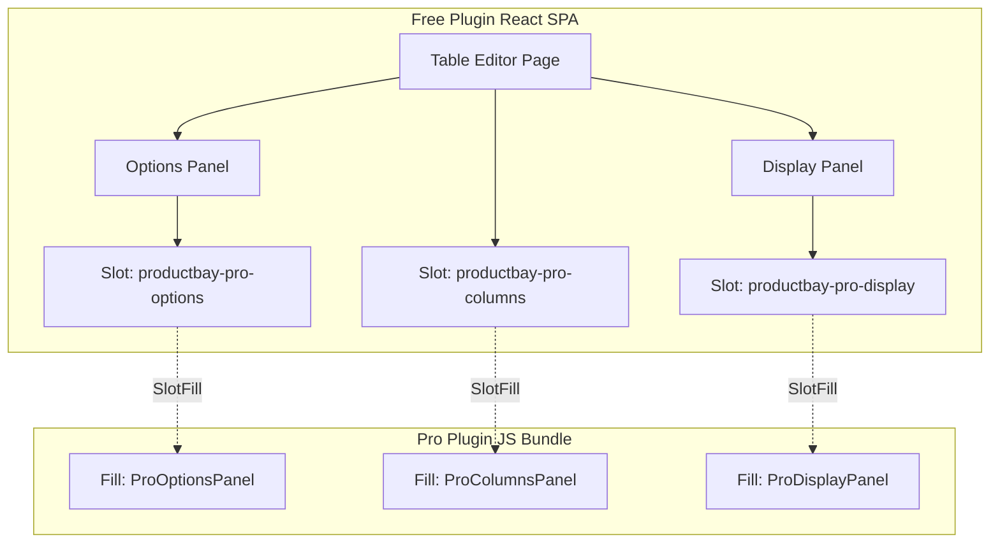

# ProductBay Pro — Architecture

This document defines the architecture of the **ProductBay Pro** add-on plugin, which extends the free [ProductBay](../productbay.php) plugin through its hook-based extensibility API.

> **Architecture Model**: Free + Pro add-on pattern (same model as WooCommerce + WC extensions).
> The pro plugin **never** touches the database directly — it piggybacks on the free plugin's hooks, filters, and REST API.

---

## Table of Contents

- [Overview](#overview)
- [Relationship with Free Plugin](#relationship-with-free-plugin)
- [Directory Structure](#directory-structure)
- [Bootstrap & Lifecycle](#bootstrap--lifecycle)
- [Available Hooks (Free Plugin)](#available-hooks-free-plugin)
- [Code Strategy — Where Code Lives](#code-strategy--where-code-lives)
- [Admin React Integration (SlotFill)](#admin-react-integration-slotfill)
- [Frontend Integration (Shortcode)](#frontend-integration-shortcode)
- [Licensing & Updates](#licensing--updates)
- [Build & Release](#build--release)

> **See Also**: [Pro_Plan.md](../instructions/Pro_Plan.md) — Prioritized feature roadmap with implementation details.

---

## Overview

ProductBay Pro is a **private, premium add-on** distributed independently of WordPress.org. It layers pro-only features onto the free plugin by hooking into its extensibility API (30+ actions and filters).

### Core Principles

1. **Zero direct DB access** — All data flows through the free plugin's repositories and REST API
2. **Hook-only integration** — Pro features use `add_action()` / `add_filter()` exclusively
3. **Graceful degradation** — If pro is deactivated, free works exactly as before
4. **Frontend bridge** — Pro signals its presence via `productbay_admin_script_data` so React can conditionally render pro UI
5. **Separate namespace** — `WpabProductBayPro\` to avoid collisions

---

## Relationship with Free Plugin



### Dependency Chain

| Check | Mechanism |
|-------|-----------|
| Free plugin active | `defined('PRODUCTBAY_VERSION')` in `plugins_loaded` |
| Minimum free version | `version_compare()` against `PRODUCTBAY_PRO_MIN_FREE_VERSION` |
| Admin notices | Shown if either check fails |

---

## Directory Structure

```
productbay-pro/
├── productbay-pro.php              # Main plugin file (bootstrap + dependency checks)
├── composer.json                   # PSR-4: WpabProductBayPro\ → app/
├── package.json                    # Build + Release scripts
├── webpack.config.js               # Extends @wordpress/scripts
├── tsconfig.json                   # TypeScript config
│
├── app/                            # PHP Backend
│   ├── Core/
│   │   └── ProPlugin.php           # Bootstrap: registers all hooks + enqueues assets
│   │
│   ├── Modules/                    # Feature modules (each self-contained)
│   │   ├── Variations/             # Variable/grouped product popups + nested rows
│   │   ├── CustomFields/           # Advanced meta selector with ACF detection
│   │   ├── Columns/                # Pro column types (rating, weight, etc.)
│   │   ├── LazyLoading/            # Infinite scroll / load-on-demand
│   │   ├── Sorting/                # Multi-column, persistent, ACF sorting
│   │   ├── ImportExport/           # Table config import/export
│   │   ├── QuickView/              # Product modal popup
│   │   ├── CustomCSS/              # Per-table custom CSS editor
│   │   ├── Responsive/             # Stack Cards / Accordion modes
│   │   ├── Filters/                # Advanced filter options
│   │   ├── Templates/              # Premium style presets
│   │   └── Analytics/              # Impression/click tracking
│   │
│   ├── Api/                        # Pro-only REST endpoints
│   │   └── LicenseController.php
│   │
│   └── index.php                   # Security file
│
├── src/                            # React/TypeScript (Pro Admin UI)
│   ├── index.tsx                   # Entry point — registers all SlotFills
│   ├── slots/                      # SlotFill components per feature
│   │   ├── VariationsPanel.tsx
│   │   ├── CustomFieldsPanel.tsx
│   │   ├── ProColumnsPanel.tsx
│   │   ├── SortingPanel.tsx
│   │   ├── CustomCSSPanel.tsx
│   │   └── ...
│   ├── components/                 # Shared pro UI components
│   ├── hooks/                      # Pro-specific hooks
│   └── types/                      # Pro TypeScript types
│
├── assets/                         # Compiled output (JS + CSS)
│   ├── js/
│   │   ├── productbay-pro-admin.js       # Admin SlotFill bundle
│   │   ├── productbay-pro-admin.asset.php
│   │   └── productbay-pro-frontend.js    # Frontend interactivity (sorting, lazy load)
│   └── css/
│       ├── productbay-pro-admin.css
│       └── productbay-pro-frontend.css
│
├── languages/
│   └── productbay-pro.pot
│
├── scripts/
│   └── package-plugin.js           # Release packaging script
│
├── dist/                           # Release staging
├── LICENSE.txt
└── README.md
```

### Module Pattern

Each feature lives in its own `Modules/` subdirectory with a single entry-point class. The `ProPlugin::init()` method instantiates each module. Modules register their own hooks internally.

```php
// app/Modules/Sorting/SortingModule.php
class SortingModule {
    public function init() {
        \add_filter('productbay_table_columns', [$this, 'add_sort_attributes'], 10, 2);
        \add_filter('productbay_query_args', [$this, 'apply_sort_params'], 10, 3);
        \add_action('productbay_enqueue_frontend_assets', [$this, 'enqueue_sort_scripts']);
    }
}
```

---

## Bootstrap & Lifecycle



### Load Order

1. **WordPress** loads all plugins
2. **Free plugin** initializes at default priority
3. **Pro plugin** hooks into `plugins_loaded` at **priority 20** (after free)
4. Pro verifies free is active and meets version requirements
5. `productbay_loaded` fires → Pro bootstraps its modules
6. Each module registers its own hooks into the free plugin

---

## Available Hooks (Free Plugin)

The free plugin exposes **30+ hooks** across all layers. Here is the full reference:

### Core Layer

| Hook | Type | Location | Purpose |
|------|------|----------|---------|
| `productbay_loaded` | Action | `Plugin.php` | Free plugin fully initialized |
| `productbay_admin_init` | Action | `Plugin.php` | Admin components ready |

### Data Layer

| Hook | Type | Location | Purpose |
|------|------|----------|---------|
| `productbay_before_save_table` | Filter | `TableRepository.php` | Modify table data before save |
| `productbay_after_save_table` | Action | `TableRepository.php` | Post-save operations |
| `productbay_after_delete_table` | Action | `TableRepository.php` | Cleanup after table deletion |
| `productbay_table_data` | Filter | `TableRepository.php` | Extend table data on read |

### API Layer

| Hook | Type | Location | Purpose |
|------|------|----------|---------|
| `productbay_register_routes` | Action | `Router.php` | Register pro REST endpoints |
| `productbay_default_settings` | Filter | `SettingsController.php` | Add pro default settings |
| `productbay_get_settings` | Filter | `SettingsController.php` | Extend settings response |
| `productbay_settings_updated` | Action | `SettingsController.php` | React to setting changes |
| `productbay_system_status` | Filter | `SystemController.php` | Add pro status info |

### Frontend Rendering

| Hook | Type | Location | Purpose |
|------|------|----------|---------|
| `productbay_table_columns` | Filter | `TableRenderer.php` | Modify columns before render |
| `productbay_query_args` | Filter | `TableRenderer.php` | Modify WP_Query args |
| `productbay_table_styles` | Filter | `TableRenderer.php` | Inject/modify scoped CSS |
| `productbay_before_table` | Action | `TableRenderer.php` | Content before table |
| `productbay_after_table` | Action | `TableRenderer.php` | Content after table |
| `productbay_toolbar_start` | Action | `TableRenderer.php` | Toolbar start area |
| `productbay_toolbar_end` | Action | `TableRenderer.php` | Toolbar end area |
| `productbay_render_filters` | Action | `TableRenderer.php` | Custom filter dropdowns |
| `productbay_before_row` | Action | `TableRenderer.php` | Before each product row |
| `productbay_after_row` | Action | `TableRenderer.php` | After each product row |
| `productbay_cell_output` | Filter | `TableRenderer.php` | Custom column type rendering |
| `productbay_table_output` | Filter | `TableRenderer.php` | Complete HTML output |

### Frontend AJAX & Shortcode

| Hook | Type | Location | Purpose |
|------|------|----------|---------|
| `productbay_ajax_filter_response` | Filter | `AjaxRenderer.php` | Extend AJAX response data |
| `productbay_after_bulk_add_to_cart` | Action | `AjaxRenderer.php` | Post bulk-add operations |
| `productbay_shortcode_atts` | Filter | `Shortcode.php` | Modify shortcode attributes |
| `productbay_enqueue_frontend_assets` | Action | `Shortcode.php` | Enqueue pro frontend assets |

### Admin Layer

| Hook | Type | Location | Purpose |
|------|------|----------|---------|
| `productbay_after_register_menu` | Action | `Admin.php` | Add pro admin submenus |
| `productbay_admin_script_data` | Filter | `Admin.php` | Pass pro flags to React |
| `productbay_enqueue_admin_assets` | Action | `Admin.php` | Enqueue pro admin assets |

---

## Code Strategy — Where Code Lives

The pro plugin ships **its own React bundle and frontend assets** separately from the free plugin. This ensures pro source code is never exposed in the free download.

> [!IMPORTANT]
> **Pro React/JS/CSS code lives exclusively in the pro plugin.** It is never bundled with the free version. This protects the source code of the paid product.

### What Stays in FREE

| Layer | What | Why |
|-------|------|-----|
| PHP Hooks | All `do_action()` / `apply_filters()` | Extension points — already done |
| React Slots | Empty `<Slot>` mount points in the admin SPA | Pro fills these with its own components |
| Script data bridge | `productbay_admin_script_data` filter | Pro passes flags to frontend |
| Frontend hooks | `productbay_enqueue_frontend_assets`, toolbar actions | Pro injects its own assets |

### What Lives in PRO

| Layer | What | Why |
|-------|------|-----|
| PHP Modules | `app/Modules/*` — all hook callbacks | Server-side logic |
| React Source | `src/` — pro admin UI components (SlotFills) | Pro-only admin SPA features |
| Admin Bundle | `assets/js/productbay-pro-admin.js` | Compiled pro React code |
| Frontend JS | `assets/js/productbay-pro-frontend.js` | Sort handlers, lazy load, export |
| Frontend CSS | `assets/css/productbay-pro-frontend.css` | Pro column styles, responsive modes |
| Build pipeline | `webpack.config.js` + `@wordpress/scripts` | Compiles pro's own bundles |

### Shared UI Components (Global UI)

To maintain design consistency and reduce the Pro bundle size, the Free plugin strictly avoids duplicating common UI components (e.g., `<Button>`, `<Toggle>`, `<Select>`). Instead, the Free plugin exposes its entire UI component library globally.

**1. Exposure (Free)**
The Free plugin exports all of its reusable React components onto the global window object during initialization in its main entrypoint (`src/index.tsx`):
```tsx
window.productbay = window.productbay || {};
window.productbay.ui = { Button, Toggle, Select /* ... */ };
```

**2. Type Safety (Pro)**
To retain strict TypeScript support, the Pro plugin defines this global object in a declaration file (`src/types/productbay.d.ts`):
```tsx
declare global {
    interface Window {
        productbay: {
            ui: {
                Button: React.FC<ButtonProps>;
                // ...
            };
        };
    }
}
```

**3. Consumption Proxy (Pro)**
Finally, the Pro plugin creates a proxy export file (`src/components/ui/index.ts`) that pulls from the global object. This allows Pro developers to write clean, standard imports without knowing they are bridging plugins:
```tsx
// Pro plugin implementation
const { Button } = window.productbay.ui;
export { Button };

// Pro usage example
import { Button } from '@/components/ui';
```

> **See Also**: [Pro_Plan.md](../instructions/Pro_Plan.md) for the full prioritized feature list and implementation details per module.

---

## Admin React Integration (SlotFill)

The pro plugin injects its React UI into the free plugin's admin SPA using the **WordPress SlotFill pattern** — the same approach used by WooCommerce extensions and Gutenberg.

### How It Works



### Step 1: Free Plugin Defines Slots

In the free plugin's React components, we add empty `<Slot>` components where pro UI should appear:

```tsx
// Free: src/components/Table/panels/OptionsPanel.tsx
import { Slot } from '@wordpress/components';

const OptionsPanel = () => (
    <section>
        {/* ... free options ... */}

        {/* Pro features inject here */}
        <Slot name="productbay-pro-options" />
    </section>
);
```

> Slots render nothing if no Fill is registered — zero impact on free users.

### Step 2: Pro Plugin Registers Fills

The pro plugin's React bundle registers `<Fill>` components that render into the slots:

```tsx
// Pro: src/slots/ProOptionsPanel.tsx
import { Fill } from '@wordpress/components';
import { __ } from '@wordpress/i18n';

const ProOptionsPanel = () => (
    <Fill name="productbay-pro-options">
        <SettingsSection
            title={__('Sorting', 'productbay-pro')}
            description={__('Multi-column sorting options', 'productbay-pro')}
        >
            {/* Pro sorting controls */}
        </SettingsSection>
    </Fill>
);
```

### Step 3: Pro Bundle Enqueued via Hook

The pro plugin's PHP enqueues its compiled admin bundle:

```php
// Pro: app/Core/ProPlugin.php
public function init() {
    \add_action('productbay_enqueue_admin_assets', [$this, 'enqueue_admin_bundle']);
    \add_filter('productbay_admin_script_data', [$this, 'extend_admin_data']);
}

public function enqueue_admin_bundle() {
    $asset = require PRODUCTBAY_PRO_PATH . 'assets/js/productbay-pro-admin.asset.php';
    \wp_enqueue_script(
        'productbay-pro-admin',
        PRODUCTBAY_PRO_URL . 'assets/js/productbay-pro-admin.js',
        array_merge($asset['dependencies'], ['productbay-admin']),
        $asset['version'],
        true
    );
    \wp_enqueue_style(
        'productbay-pro-admin',
        PRODUCTBAY_PRO_URL . 'assets/css/productbay-pro-admin.css',
        ['productbay-admin'],
        $asset['version']
    );
}
```

### Script Data Bridge

Pro passes feature flags to the React app via the existing filter:

```php
public function extend_admin_data($data) {
    $data['proActive']   = true;
    $data['proVersion']  = PRODUCTBAY_PRO_VERSION;
    $data['proFeatures'] = [
        'variations'   => true,
        'customFields' => true,
        'sorting'      => true,
        // ... per-module flags
    ];
    return $data;
}
```

The free plugin reads `window.productbay.proActive` to show subtle indicators (e.g., "PRO" badges next to slots), but the actual pro UI is rendered entirely by the pro bundle.

### Slot Locations Needed in Free

These slots need to be added in the free plugin's React components:

| Slot Name | Location in Free | Pro Feature |
|-----------|-----------------|-------------|
| `productbay-pro-options` | `OptionsPanel.tsx` | Sorting, lazy loading, custom CSS toggles |
| `productbay-pro-columns` | `ColumnEditor.tsx` | Pro column types (rating, weight, etc.) |
| `productbay-pro-display` | `DisplayPanel.tsx` | Responsive modes, premium templates |
| `productbay-pro-source` | `SourcePanel.tsx` | Advanced meta selector, ACF integration |
| `productbay-pro-toolbar` | `Table.tsx` | Import/export, analytics controls |
| `productbay-pro-dashboard` | `Dashboard.tsx` | License status, analytics summary |

### Pro REST Endpoints

Pro registers its own endpoints via `productbay_register_routes`:

```php
// Registered under the same namespace: productbay/v1
register_rest_route('productbay/v1', '/pro/license', [...]);
register_rest_route('productbay/v1', '/pro/meta-keys', [...]);
register_rest_route('productbay/v1', '/pro/analytics', [...]);
```

---

## Frontend Integration (Shortcode)

For the public-facing frontend (shortcode-rendered tables), pro extends through **PHP hooks + its own JS/CSS assets**. No SlotFill needed here — it's standard WordPress hook architecture.

### PHP Hooks

```php
// Pro modules hook into the free renderer
\add_action('productbay_toolbar_end', [$this, 'render_export_buttons']);
\add_action('productbay_enqueue_frontend_assets', [$this, 'enqueue_pro_frontend']);
\add_filter('productbay_cell_output', [$this, 'render_pro_columns'], 10, 3);
\add_filter('productbay_table_styles', [$this, 'inject_pro_css'], 10, 2);
\add_filter('productbay_table_output', [$this, 'wrap_for_lazy_loading'], 10, 2);
\add_action('productbay_after_row', [$this, 'render_nested_variation_rows'], 10, 2);
```

### Asset Enqueuing

```php
public function enqueue_pro_frontend() {
    \wp_enqueue_script(
        'productbay-pro-frontend',
        PRODUCTBAY_PRO_URL . 'assets/js/productbay-pro-frontend.js',
        ['productbay-frontend'],
        PRODUCTBAY_PRO_VERSION,
        true
    );
    \wp_enqueue_style(
        'productbay-pro-frontend',
        PRODUCTBAY_PRO_URL . 'assets/css/productbay-pro-frontend.css',
        ['productbay-frontend'],
        PRODUCTBAY_PRO_VERSION
    );
}
```

---

## Licensing & Updates

ProductBay Pro uses a **custom license server** for validation and update delivery.

| Component | Responsibility |
|-----------|----------------|
| License validation | `LicenseController.php` — validates key against our license server |
| Update delivery | WordPress `pre_set_site_transient_update_plugins` filter |
| Admin notices | Shown on expiry/invalid license via `admin_notices` |
| Feature gating | Individual modules can check license status before activating |

> [!NOTE]
> Licensing implementation will be handled in a later phase. The module system is designed so each module can independently check license status before activating.

---

## Build & Release

The pro plugin has **two build steps**: compiling React/TS + packaging for distribution.

### Development

```bash
bun start                 # Webpack watch (admin bundle) + Tailwind watch
bun build                 # Production build (admin + frontend bundles)
```

### Release

```bash
bun run release           # Build + package → productbay-pro.zip
bun run release:versioned # → productbay-pro-1.0.0.zip (archival)
```

### Release Contents

The `scripts/package-plugin.js` bundles:
- `app/` — PHP backend classes
- `assets/` — Compiled JS/CSS bundles
- `languages/` — Translation files
- `productbay-pro.php` — Main plugin file
- `composer.json` + `vendor/` — Production autoloader
- `LICENSE.txt`

### What's Excluded

| Excluded | Reason |
|----------|--------|
| `src/` | React/TS source — protected, only compiled output ships |
| `node_modules/` | Dev dependency only |
| `scripts/` | Build tooling only |
| `.git/` | Version control |
| `dist/` | Build staging artifacts |

> [!IMPORTANT]
> The `src/` directory containing React/TypeScript source code is **never included** in the release zip. Only the compiled `assets/` directory ships, protecting the pro source code.

---

## Tech Stack

| Component | Technology |
|-----------|------------|
| PHP | 7.4+ |
| Namespace | `WpabProductBayPro\` |
| Autoloading | PSR-4 via Composer |
| Admin UI | React + TypeScript (own bundle, SlotFill pattern) |
| Frontend JS | Vanilla JS or lightweight modules |
| Build tool | `@wordpress/scripts` (extends Webpack) |
| Text Domain | `productbay-pro` |
| Dependency | ProductBay Free ≥ 1.0.1 |

---

**Last Updated**: 2026-03-14
**Maintainer**: ProductBay Development Team
