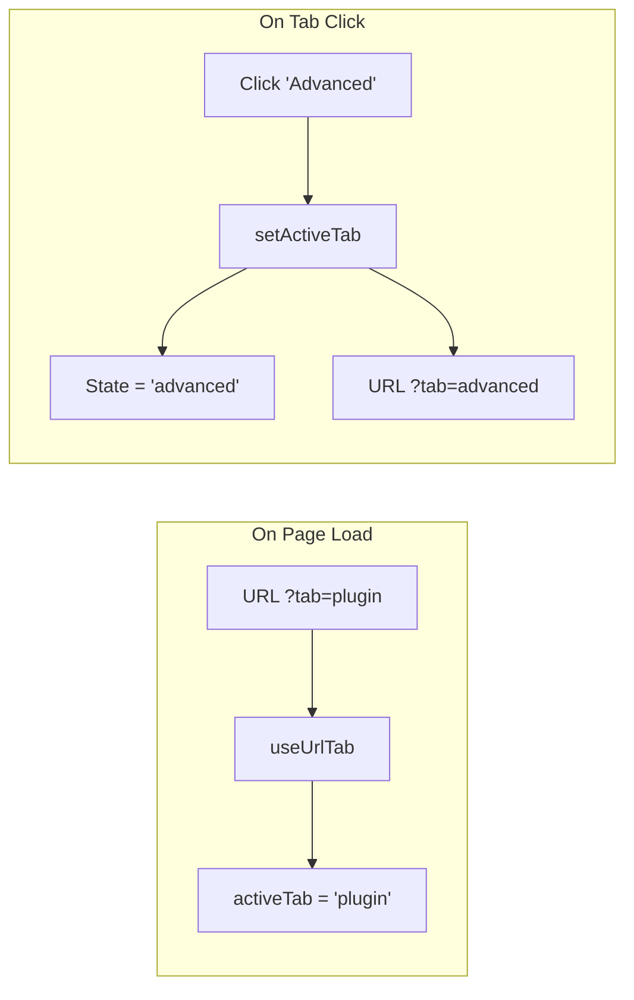

# Routing & Navigation Architecture

This document details how ProductBay's routing and navigation system works, bridging React Router with WordPress Admin Menu synchronization.

## Table of Contents

- [Overview](#overview)
- [System Components](#system-components)
- [How It Works](#how-it-works)
- [File Reference](#file-reference)
- [Adding New Routes](#adding-new-routes)
- [URL Tab Sync](#url-tab-sync-useurltab)
- [Troubleshooting](#troubleshooting)

---

## Overview

ProductBay uses a **dual-routing system**:

1. **React Router (HashRouter)** - Handles client-side navigation within the React app
2. **WordPress Admin Menu** - Provides the sidebar navigation in wp-admin

These two systems must stay synchronized so that:
- Clicking a WordPress menu item navigates to the correct React route
- Navigating within React updates the active WordPress menu item


---

## System Components

### 1. WordPress Admin Menu (PHP)

**File**: `app/Admin/Admin.php`

Registers the top-level menu and submenus. Each submenu has a unique slug:

| Menu Item     | WordPress Slug        | React Route |
| ------------- | --------------------- | ----------- |
| Dashboard     | `productbay-dash`     | `/dash`     |
| Tables        | `productbay-tables`   | `/tables`   |
| Settings      | `productbay-settings` | `/settings` |
| Add New Table | `productbay-new`      | `/new`      |

```php
// Dashboard submenu with unique slug
\add_submenu_page(
    Constants::MENU_SLUG,
    \__('Dashboard', Constants::TEXT_DOMAIN),
    \__('Dashboard', Constants::TEXT_DOMAIN),
    Constants::CAPABILITY,
    Constants::MENU_SLUG . '-dash',  // productbay-dash
    [$this, 'render_app']
);

// Remove auto-generated duplicate parent menu
\remove_submenu_page(Constants::MENU_SLUG, Constants::MENU_SLUG);
```

### 2. React Routes Configuration

**File**: `src/utils/routes.ts`

Centralized path constants and route definitions:

```typescript
export const PATHS = {
    DASHBOARD: '/dash',
    NEW: '/new',
    EDIT: '/edit/:id',
    SETTINGS: '/settings',
    TABLES: '/tables',
    // ...
} as const;

export const routes: RouteConfig[] = [
    { path: PATHS.DASHBOARD, element: Dashboard, showInNav: true },
    { path: PATHS.TABLES, element: Tables, showInNav: true },
    // ...
];
```

### 3. Deep Linking Handler

**File**: `src/index.tsx`

Maps WordPress `?page=` parameter to React hash routes on initial load:

```typescript
const page = urlParams.get('page');
switch (page) {
    case 'productbay-dash':
    case 'productbay':  // Fallback for parent menu
        window.location.hash = `#${PATHS.DASHBOARD}`;
        break;
    case 'productbay-tables':
        window.location.hash = `#${PATHS.TABLES}`;
        break;
    // ...
}
```

### 4. Menu Sync Hook

**File**: `src/hooks/useWpMenuSync.ts`

Syncs React Router location with WordPress admin menu on every navigation:

```typescript
export const useWpMenuSync = () => {
    const location = useLocation();
    
    useEffect(() => {
        // 1. Map React path to WordPress slug
        const slug = getSlugFromPath(location.pathname);
        
        // 2. Update browser URL (?page=slug)
        window.history.replaceState(...);
        
        // 3. Find the admin menu link and toggle .current class
        const menuLink = findAdminMenuLink(slug);
        toggleCurrentClass(menuLink);
    }, [location]);
};
```

---

## How It Works

### Flow 1: User Clicks WordPress Menu

```
1. User clicks "Settings" in WordPress sidebar
2. Browser navigates to: admin.php?page=productbay-settings
3. PHP renders the React app container
4. index.tsx reads ?page=productbay-settings
5. Sets hash to #/settings
6. React Router renders Settings page
7. useWpMenuSync already has correct menu highlighted
```

### Flow 2: User Navigates Within React

```
1. User clicks "Dashboard" in React navbar
2. React Router navigates to #/dash
3. useWpMenuSync fires (location changed)
4. Hook maps /dash → productbay-dash slug
5. Updates URL to ?page=productbay-dash#/dash
6. Finds <a href="admin.php?page=productbay-dash">
7. Removes .current from all menu items
8. Adds .current to Dashboard menu item
```

---

## File Reference

| File                               | Purpose                            |
| ---------------------------------- | ---------------------------------- |
| `app/Admin/Admin.php`              | Registers WordPress admin menus    |
| `app/Core/Constants.php`           | Defines `MENU_SLUG = 'productbay'` |
| `src/utils/routes.ts`              | Defines PATHS and route configs    |
| `src/index.tsx`                    | Deep linking on initial load       |
| `src/hooks/useWpMenuSync.ts`       | Syncs menu on navigation           |
| `src/hooks/useUrlTab.ts`           | Syncs tab state with URL params    |
| `src/layouts/AdminLayout.tsx`      | Calls `useWpMenuSync()` hook       |
| `src/components/Layout/Navbar.tsx` | React navigation component         |

---

## Adding New Routes

Follow these steps to add a new route (e.g., "Analytics"):

### Step 1: Register WordPress Submenu

**File**: `app/Admin/Admin.php`

```php
// Register "Analytics" submenu
\add_submenu_page(
    Constants::MENU_SLUG,
    \__('Analytics', Constants::TEXT_DOMAIN),
    \__('Analytics', Constants::TEXT_DOMAIN),
    Constants::CAPABILITY,
    Constants::MENU_SLUG . '-analytics',  // productbay-analytics
    [$this, 'render_app']
);
```

### Step 2: Add Path Constant

**File**: `src/utils/routes.ts`

```typescript
export const PATHS = {
    // ...existing paths
    ANALYTICS: '/analytics',
} as const;
```

### Step 3: Add Route Config

**File**: `src/utils/routes.ts`

```typescript
import Analytics from '@/pages/Analytics';

export const routes: RouteConfig[] = [
    // ...existing routes
    {
        path: PATHS.ANALYTICS,
        element: Analytics,
        label: __('Analytics', 'productbay'),
        showInNav: true,  // true to show in navbar
    },
];
```

### Step 4: Create Page Component

**File**: `src/pages/Analytics.tsx`

```typescript
const Analytics = () => {
    return <div>Analytics Page</div>;
};

export default Analytics;
```

### Step 5: Add Deep Link Handler

**File**: `src/index.tsx`

```typescript
case 'productbay-analytics':
    window.location.hash = `#${PATHS.ANALYTICS}`;
    break;
```

### Step 6: Add Menu Sync Mapping

**File**: `src/hooks/useWpMenuSync.ts`

```typescript
} else if (path === PATHS.ANALYTICS) {
    slug = 'productbay-analytics';
}
```

---

## URL Tab Sync (`useUrlTab`)

Pages with tabbed interfaces can sync their active tab with URL search params, enabling:
- **Deep linking**: `#/settings?tab=plugin` opens Settings with Plugin tab active
- **Shareable URLs**: Share a link that opens a specific tab
- **Browser history**: Tab changes can be navigated with back/forward buttons

### Why Search Params (Not Hash Fragments)?

Since the app uses `HashRouter`, the URL hash is already used for routing:
```
admin.php?page=productbay#/settings
                          ↑ Hash used by router
```

We cannot nest another hash (`#/settings#plugin`), so we use **search params** instead:
```
admin.php?page=productbay#/settings?tab=plugin
                                    ↑ Search param for tab
```

### Hook: `useUrlTab`

**File**: `src/hooks/useUrlTab.ts`

A drop-in replacement for `useState` that syncs tab state with URL:

```typescript
import { useUrlTab } from '@/hooks/useUrlTab';

type MyTabValue = 'first' | 'second' | 'third';

const VALID_TABS = ['first', 'second', 'third'] as const;

const MyPage = () => {
    // Works just like useState, but syncs with URL
    const [activeTab, setActiveTab] = useUrlTab<MyTabValue>('first', VALID_TABS);
    
    return (
        <Tabs value={activeTab} onChange={setActiveTab}>
            {/* Tab content */}
        </Tabs>
    );
};
```

### Hook Parameters

| Parameter    | Type           | Description                                 |
| ------------ | -------------- | ------------------------------------------- |
| `defaultTab` | `T`            | Default tab when URL param is empty/invalid |
| `validTabs`  | `readonly T[]` | Array of valid tab values for validation    |
| `paramName`  | `string`       | Search param name (default: `'tab'`)        |

### URL Format

| Page     | URL Example               | Active Tab           |
| -------- | ------------------------- | -------------------- |
| Settings | `#/settings`              | `default` (fallback) |
| Settings | `#/settings?tab=plugin`   | `plugin`             |
| Settings | `#/settings?tab=advanced` | `advanced`           |
| Table    | `#/new?tab=display`       | `display`            |
| Table    | `#/new?tab=settings`      | `settings`           |

### Implementation in Pages

**Settings Page** (`src/pages/Settings.tsx`):
```typescript
type SettingsTabValue = 'default' | 'advanced' | 'plugin';
const VALID_SETTINGS_TABS = ['default', 'advanced', 'plugin'] as const;

const [activeTab, setActiveTab] = useUrlTab<SettingsTabValue>('default', VALID_SETTINGS_TABS);
```

**Table Page** (`src/pages/Table.tsx`):
```typescript
type TableTabValue = 'table' | 'display' | 'settings';
const VALID_TABLE_TABS = ['table', 'display', 'settings'] as const;

const [activeTab, setActiveTab] = useUrlTab<TableTabValue>('table', VALID_TABLE_TABS);
```

### How It Works



1. **On mount**: Hook reads `?tab=` param, validates against `validTabs`, sets state
2. **On tab click**: `setActiveTab` updates both state AND URL (using `replace: true`)
3. **On browser back/forward**: Hook syncs state with URL automatically

---

## Troubleshooting

### Menu Not Syncing

**Symptom**: React navbar shows correct page, but WordPress menu highlights wrong item.

**Causes**:
1. Missing slug mapping in `useWpMenuSync.ts`
2. Path constant mismatch between routes.ts and hook

**Fix**: Ensure path → slug mapping is correct in `useWpMenuSync`.

### External Links Matching

**Symptom**: Menu sync works in dev but fails in production.

**Cause**: Third-party plugins (e.g., Freemius) inject external links containing `page=` parameter.

**Solution**: The hook filters links to only match:
- Relative `admin.php` links
- Absolute links starting with `window.location.origin`

```typescript
const isRelativeAdminLink = href.startsWith('admin.php');
const isAbsoluteAdminLink = href.startsWith(window.location.origin) && href.includes('admin.php');
```

### Deep Link Not Working

**Symptom**: Clicking WordPress menu loads the app but shows wrong page.

**Cause**: Missing case in `index.tsx` switch statement.

**Fix**: Add the WordPress slug → React hash mapping in `index.tsx`.

---

**Last Updated**: 2026-02-03  
**Related**: [ARCHITECTURE.md](./ARCHITECTURE.md)
