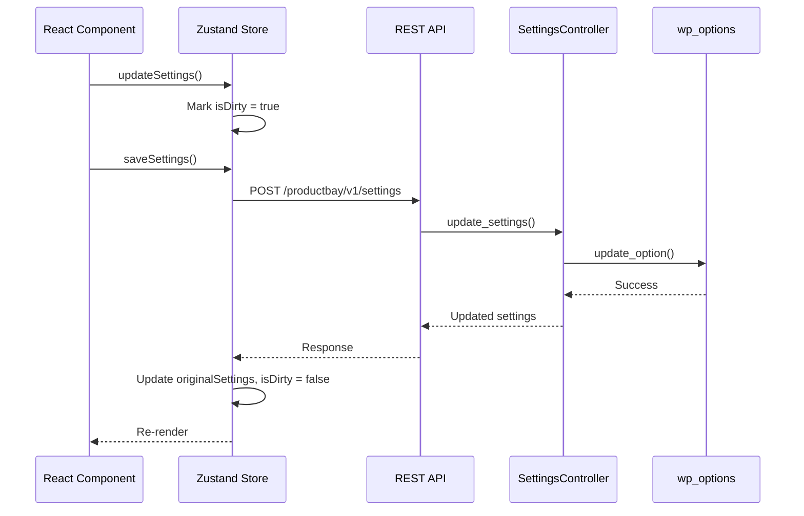

# Settings Architecture

This document details the settings system of the ProductBay plugin, explaining how settings are structured, stored, and managed across PHP and React.

## Table of Contents

- [Overview](#overview)
- [Settings Storage](#settings-storage)
- [Data Flow](#data-flow)
- [Plugin Settings Tab](#plugin-settings-tab)
  - [Admin Bar](#1-admin-bar)
  - [Uninstall Options](#2-uninstall-options)
- [Reload-Required Settings Pattern](#reload-required-settings-pattern)

---

## Overview

ProductBay uses the WordPress Options API to persist plugin settings. The settings are managed through:

1. **PHP Backend**: `SettingsController.php` handles storage and defaults
2. **React Frontend**: `settingsStore.ts` (Zustand) manages client-side state
3. **UI Components**: Individual settings components in `src/components/Settings/`

---

## Settings Storage

### Database Structure

Settings are stored in the `wp_options` table:

| Option Name           | Type  | Description                 |
| --------------------- | ----- | --------------------------- |
| `productbay_settings` | array | All plugin settings as JSON |

### Default Values

Defined in `app/Api/SettingsController.php`:

```php
private function defaults()
{
    return [
        'add_to_cart_text' => 'Add to Cart',
        'products_per_page' => 10,
        'show_admin_bar' => true,
        'delete_on_uninstall' => true,
        'design' => [
            'header_bg' => '#f3f4f6',
            'border_color' => '#e5e7eb'
        ]
    ];
}
```

---

## Data Flow



---

## Plugin Settings Tab

The Plugin tab (`Settings > Plugin`) contains settings that control the plugin's behavior within WordPress.

### 1. Admin Bar

**Purpose**: Toggle the display of ProductBay menu in the WordPress admin bar (top bar).

| Property        | Value            |
| --------------- | ---------------- |
| Setting Key     | `show_admin_bar` |
| Default         | `true`           |
| Type            | `boolean`        |
| Requires Reload | ✅ Yes            |

#### Files Involved

| File                                          | Role                                    |
| --------------------------------------------- | --------------------------------------- |
| `src/components/Settings/AdminBarOptions.tsx` | UI toggle component                     |
| `app/Api/SettingsController.php`              | Stores setting in database              |
| `app/Admin/Admin.php`                         | Reads setting in `register_admin_bar()` |

#### How It Works

1. **Frontend Toggle**: `AdminBarOptions.tsx` renders a toggle switch
2. **Save**: Setting saved to `productbay_settings` option in database
3. **PHP Check**: `Admin.php::register_admin_bar()` reads the setting:

```php
public function register_admin_bar(\WP_Admin_Bar $wp_admin_bar): void
{
    // Check if admin bar is enabled in plugin settings
    $settings = \get_option('productbay_settings', []);
    $show_admin_bar = $settings['show_admin_bar'] ?? true;

    if (!$show_admin_bar) {
        return; // Skip rendering admin bar menu
    }

    // ... register admin bar nodes
}
```

4. **Reload Modal**: Since the admin bar is rendered server-side (PHP), a page reload is required. The Settings page shows a modal prompting the user to reload.

---

### 2. Uninstall Options

**Purpose**: Control whether plugin data is deleted when the plugin is uninstalled.

| Property        | Value                 |
| --------------- | --------------------- |
| Setting Key     | `delete_on_uninstall` |
| Default         | `true`                |
| Type            | `boolean`             |
| Requires Reload | ❌ No                  |

#### Files Involved

| File                                           | Role                                 |
| ---------------------------------------------- | ------------------------------------ |
| `src/components/Settings/UninstallOptions.tsx` | UI toggle component                  |
| `app/Api/SettingsController.php`               | Stores setting in database           |
| `uninstall.php`                                | Reads setting during plugin deletion |

#### How It Works

1. **Frontend Toggle**: `UninstallOptions.tsx` renders a toggle switch with warning styling (red)
2. **Save**: Setting saved to `productbay_settings` option in database
3. **Uninstall Check**: When the plugin is deleted, `uninstall.php` reads the setting:

```php
// Check if user opted to delete data on uninstall
$settings = get_option('productbay_settings', []);
$delete_on_uninstall = isset($settings['delete_on_uninstall']) 
    ? $settings['delete_on_uninstall'] 
    : true;

if ($delete_on_uninstall) {
    // Delete all Custom Post Type data
    // Delete options
    // Clean up orphaned metadata
}
```

#### Data Deleted When Enabled

- All `productbay_table` Custom Post Type entries
- `productbay_settings` option
- Any orphaned `_productbay_config` post meta

---

## Reload-Required Settings Pattern

Some settings require a page reload because they affect server-side (PHP) rendered elements. Here's the pattern used:

### Implementation

```tsx
// 1. Track original value before save
const adminBarValueBeforeSave = useRef<boolean | undefined>(undefined);

// 2. Capture value before saving
const handleSave = async () => {
    adminBarValueBeforeSave.current = originalSettings.show_admin_bar;
    
    await saveSettings();
    
    // 3. Check if setting changed
    const adminBarChanged = adminBarValueBeforeSave.current !== settings.show_admin_bar;
    if (adminBarChanged) {
        setShowReloadModal(true); // 4. Show reload modal
    }
};

// 5. Reload handler
const handleReload = () => {
    window.location.reload();
};
```

### Modal UX

```
┌─────────────────────────────────────────────────────────┐
│           Page Reload Required                          │
│                                                         │
│  The admin bar setting requires a page reload to take   │
│  effect. Would you like to reload now?                  │
│                                                         │
│                    [Later]    [🔄 Reload Now]           │
└─────────────────────────────────────────────────────────┘
```

The modal only appears **after** the settings are saved successfully, ensuring no data is lost.

---

## Adding New Settings

To add a new setting:

1. **Add default value** in `SettingsController.php::defaults()`
2. **Create component** in `src/components/Settings/` (follow existing patterns)
3. **Import and render** component in `Settings.tsx`
4. **If reload required**: Implement the reload-required pattern (see above)
5. **Backend usage**: Read from `get_option('productbay_settings')` in PHP

---

**Last Updated**: 2026-02-02  
**Maintainer**: ProductBay Development Team
