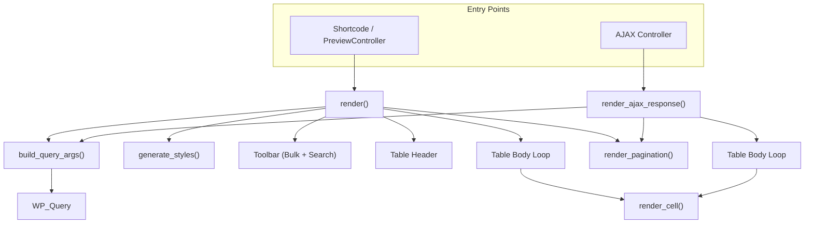

# TableRenderer — Architecture Note

> **File**: `app/Frontend/TableRenderer.php`
> **Namespace**: `WpabProductBay\Frontend`
> **Lines**: ~625 | **Methods**: 14 (3 public, 11 private)

---

## Overview

`TableRenderer` is the server-side rendering engine that converts a table configuration array (from the admin builder) into HTML + CSS output for the WordPress frontend. It handles two rendering paths:

1. **Full render** (`render()`) — Returns complete HTML (styles + wrapper + table + toolbar + pagination)
2. **AJAX render** (`render_ajax_response()`) — Returns only rows + pagination HTML for live filtering/search/paging



---

## Dependency

```php
protected $repository; // TableRepository (injected via constructor)
```

`TableRepository` is injected but not directly used in rendering — it is available for potential data lookups. The constructor is the only setup; `init()` is a placeholder for future hooks.

---

## Input Data Shape

The `$table` configuration array follows this structure:

```
$table = [
    'id'       => int,         // Table post ID (0 for preview)
    'source'   => [            // Product query configuration
        'type'      => 'all' | 'specific' | 'category' | 'sale',
        'queryArgs' => [...],  // postIds, categoryIds, excludes, stockStatus, priceRange
        'sort'      => ['orderBy' => string, 'order' => 'ASC'|'DESC'],
    ],
    'columns'  => [...],       // Array of column definitions
    'settings' => [            // Feature toggles & pagination
        'features' => [
            'search'     => bool,
            'pagination' => bool,
            'bulkSelect' => ['enabled' => bool, 'position' => 'first'|'last', 'width' => [...]],
        ],
        'pagination' => ['limit' => int],
    ],
    'style'    => [            // Visual style config
        'header' => [...],
        'body'   => [...],
        'button' => [...],
        'layout' => [...],
        'hover'  => [...],
    ],
];
```

`$runtime_args` are dynamic values from the frontend request:

```
$runtime_args = [
    's'     => string,   // Search query
    'paged' => int,      // Current page number
];
```

---

## Method Breakdown

### `render($table, $runtime_args = [])` — Full Render Pipeline

**Steps (in order):**

| # | Action | Details |
|---|--------|---------|
| 1 | Generate unique ID | `productbay-table-{id}` or `productbay-table-preview-{rand}` for previews |
| 2 | Extract config | `$source`, `$columns`, `$settings`, `$style` from `$table` |
| 3 | Build WP_Query args | Delegates to `build_query_args()` |
| 4 | Execute WP_Query | `new \WP_Query($args)` |
| 5 | Generate styles | Delegates to `generate_styles()`, outputs `<style>` tag |
| 6 | Render wrapper | `.productbay-wrapper` div with `data-table-id` and `data-select-position` attributes |
| 7 | Render toolbar | Bulk action button + search bar (conditionally) |
| 8 | Render `<thead>` | Bulk select checkbox (if position = first) → column headers → bulk select (if position = last) |
| 9 | Render `<tbody>` | Product loop with `render_cell()` per column, or "No products found" row |
| 10 | Render pagination | Delegates to `render_pagination()` if enabled |
| 11 | Return HTML | `ob_get_clean()` |

**Key output structure:**

```html
<style>/* scoped CSS */</style>
<div class="productbay-wrapper" id="{unique_id}" data-table-id="{id}" data-select-position="{position}">
  <div class="productbay-toolbar">
    <div class="productbay-bulk-actions"><!-- button --></div>
    <div class="productbay-search"><!-- input --></div>
  </div>
  <div class="productbay-table-container">
    <table class="productbay-table">
      <thead><tr><!-- th cells --></tr></thead>
      <tbody><!-- tr rows --></tbody>
    </table>
  </div>
  <div class="productbay-pagination"><!-- links --></div>
</div>
```

---

### `build_query_args($source, $settings, $runtime_args)` — WP_Query Builder

Constructs the `WP_Query` arguments array. Logic breakdown:

**Base args (always set):**
- `post_type` → `'product'`
- `post_status` → `'publish'`
- `posts_per_page` → from `$settings['pagination']['limit']` (default: 10)
- `orderby` / `order` → from `$source['sort']`
- `paged` → from `$runtime_args['paged']` or `get_query_var('paged')`

**Search filtering:**
- If `$runtime_args['s']` is set → adds `'s'` param (sanitized)

**Source type switch:**

| Source Type | Query Logic |
|-------------|-------------|
| `'all'` | No additional filters (default behavior) |
| `'specific'` | Sets `post__in` from `queryArgs.postIds`, forces `orderby = post__in` |
| `'category'` | Adds `tax_query` on `product_cat` taxonomy with `queryArgs.categoryIds` |
| `'sale'` | Uses `wc_get_product_ids_on_sale()` into `post__in` |

**Additional filters:**
- **Excludes** → `post__not_in` from `queryArgs.excludes`
- **Stock status** → `meta_query` on `_stock_status` (skipped if `'any'`)
- **Price range** → `meta_query` BETWEEN on `_price` meta key

---

### `render_cell($col, $product)` — Cell Content Renderer

Renders the content of a single table cell based on column type:

| Column Type | Output | Notes |
|-------------|--------|-------|
| `image` | Product image (optionally linked to product page) | Size from `settings.imageSize`, link if `settings.linkTarget === 'product'` |
| `name` | Linked product title | Always links to product permalink |
| `price` | Price HTML | Uses `get_price_html()` for sale/regular formatting |
| `sku` | Plain text SKU | Escaped output |
| `stock` | WooCommerce stock HTML | Uses `wc_get_stock_html()` |
| `button` | Add to cart button, quantity inputs, variation selects | Delegates to `render_button_cell()` |
| `summary` | Short description excerpt | Trimmed to 10 words |
| `default` | Empty string | Fallback for unknown types |

---

### Product Type Rendering (`render_button_cell`, etc.)

The `button` column rendering is split into specialized methods to handle different WooCommerce product types:

| Method | Purpose | Logic |
|--------|---------|-------|
| `render_button_cell($product)` | Entry point for button column | Checks `is_in_stock()` and `is_purchasable()`. Handles `external` (outbound link) and `grouped` (view options link) products directly. Delegates to `render_variable_button_cell` for variable products. Falls back to default simple product layout. |
| `render_variable_button_cell($product)` | Handles `variable` products | Generates inline `<select>` dropdowns for each variation attribute using `wc_attribute_label()` and `get_term_by()`. Outputs hidden fields for variation ID and price. Renders quantity and Add to Cart button (initially disabled). |
| `render_quantity_input($product)` | Renders the compact stepper | Responsive to `get_stock_quantity()` and `backorders_allowed()`. Creates a `.productbay-qty-wrap` containing the numeric input and a stacked `.productbay-qty-btns` diver for plus/minus arrows. |

**UI Alignment Rules:**
* Add to Cart elements (buttons, quantity inputs, variation dropdowns) are wrapped in `.productbay-btn-cell`.
* This wrapper uses `display: flex; justify-content: flex-end;` to align all interactive elements to the right edge of the cell.

---

### `generate_styles($id, $style, $columns)` — Dynamic CSS Generator

Generates scoped CSS using the `#{id}` selector prefix for isolation. All styles are **instance-scoped** to support multiple tables per page.

**CSS sections generated:**

| Section | Selector | Properties |
|---------|----------|------------|
| Header | `#{id} .productbay-table thead th` | `background-color`, `color`, `font-size` |
| Body | `#{id} .productbay-table tbody td` | `vertical-align: top`, `background-color`, `color`, `border-color` |
| Alternate rows | `#{id} ... tr:nth-child(even) td` | `background-color`, `color` (only if `body.rowAlternate` enabled) |
| Row hover | `#{id} ... tr:hover td` | `background-color` (only if `hover.rowHoverEnabled`) |
| Add to cart button | `#{id} ... .button` | `display: inline-flex`, `min-width: 160px`, bg/text/border-radius, transitions |
| Button hover | `#{id} ... .button:hover` | Hover bg/text colors |
| Added state (✓) | `#{id} ... .button.added::after` | SVG checkmark via CSS mask |
| View Cart link | `#{id} ... .added_to_cart` | Ghost style: transparent bg, `width: max-content`, arrow icon via `::after` |
| View Cart hover | `#{id} ... .added_to_cart:hover` | Underline with `text-underline-offset: 4px` |
| Images | `#{id} img` | `max-width: 100%`, `border-radius: 3px` |
| Column widths | `#{id} .productbay-col-{colId}` | Per-column width if `advanced.width` is set |
| Bulk select width | `#{id} .productbay-col-select` | Width from `bulkSelect.width` config |

---

### `render_ajax_response($table, $runtime_args)` — AJAX Handler

Mirrors the body rendering of `render()` but returns a structured array instead of full HTML.

**Returns:**
```php
[
    'html'       => string,  // <tr> rows only (no <table>, no wrapper)
    'pagination' => string,  // Pagination HTML (or empty)
]
```

**Logic is identical to `render()` for:**
- Query building (`build_query_args`)
- Product loop (bulk select positioning + cell rendering)
- Empty state handling (colspan calculation)
- Pagination rendering

> [!IMPORTANT]
> The bulk select variable scope differs between `render()` and `render_ajax_response()`. In `render()`, `$bulk_select` is defined outside the loop. In `render_ajax_response()`, it's defined **inside** the loop. This is a potential refactor target.

---

### Helper Methods

| Method | Logic |
|--------|-------|
| `should_hide_column($col)` | Returns `true` if `$col['advanced']['visibility'] === 'none'`. Device-specific hiding is noted as TODO. |
| `get_column_classes($col)` | Returns `['productbay-col-{id}']` — single class array |
| `get_column_styles($col)` | Returns empty string (placeholder for future inline styles) |
| `render_search_bar($settings, $value)` | Outputs search input with clear button. Adds `has-value` class if pre-filled. |
| `render_pagination($query, $settings)` | Uses `paginate_links()` with `«` / `»` nav. Supports AJAX paging override. Only renders if `max_num_pages > 1`. |

---

## Bulk Select Position Logic

The bulk select column can be placed **first** or **last** (default: `last`). This is handled in three places:

1. **Toolbar** — Button alignment is controlled by `data-select-position` attribute on wrapper
2. **`<thead>`** — Checkbox header rendered before or after column headers
3. **`<tbody>`** — Checkbox cell rendered before or after column cells in each row

The position value is read from `$settings['features']['bulkSelect']['position']`.

---

## Security & Escaping

| Context | Method Used |
|---------|-------------|
| HTML attributes | `esc_attr()` |
| URLs | `esc_url()` |
| Text output | `esc_html()` |
| Rich HTML (prices, stock) | `wp_kses_post()` |
| CSS output | `wp_strip_all_tags()` |
| Search input | `sanitize_text_field()` |
| Integers | `intval()` |

---

## Key Design Decisions

1. **Output buffering** — Uses `ob_start()` / `ob_get_clean()` for procedural HTML generation
2. **Instance scoping** — All CSS is scoped to `#{unique_id}` to allow multiple tables per page
3. **No template files** — All HTML is rendered inline via `echo` statements (no PHP template partials)
4. **WooCommerce integration** — Relies on `global $product` and WC template functions for buttons/stock
5. **SVG via CSS masks** — Checkmark and arrow icons use data URI SVGs in CSS `mask-image` to inherit `currentColor`
